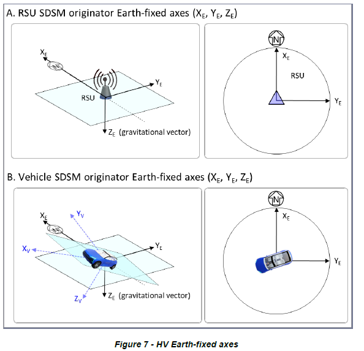
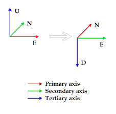

# Sensor Data Sharing Service
## Introduction
This is the **CARMA Streets** service responsible for consuming [detected_objects_msg](../streets_utils/streets_messages/DetectedObjectsMessage.md) and publishing [sensor_data_sharing_msg](../streets_utils/streets_messages/SensorDataSharingMessage.md) in accordance with the J3224 specification. This service is built on the [streets_service_base_lanelet_aware](../streets_service_base_lanelet_aware/README.md) base image to include lanelet2 dependencies used for map coordinate frame translations.
## Configuration Parameters
**TODO** Saving this part for once I finalize the implementation
> [!IMPORTANT]\
> Initial implementation of this service will not support the BSM functionality described in the J3224 specification and will also not support any data fusion from multiple infrastructure sensors.
## Covariance to confidence conversion

For covariance to confidence/accuracy translation assumed the following. All confidence/accuracy measurements in SDSM assume 95% confidence interval ( from J3224 documentation). Assuming normal distribution of measurements. Diagonal in covariance matrix is variance for each component. SD (Standard deviation) is square root of variance. 2 standard deviations covers 95 % of sample in normal distribution

## Sensor Data Sharing speed and heading
For heading and speed we use following coordinate frame (NED) as described in the J3224 specifications. 

We assume incoming detections are in the ENU cordinate frame. The `detected_object_enu_to_ned_converter` handles conversion of position and velocity in detection to NED coordinate frame.

